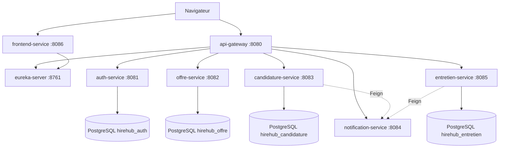

# Architecture HireHub (PROJET JEE)

## 1. Choix d architecture (collaborative et claire)

| Principe | Details |
|----------|---------|
| Monorepo Maven multi-modules | Un depot Git, un pom parent, un dossier = un livrable. Chaque membre travaille sur un module. |
| Microservices par domaine | Auth, offres, candidatures, notifications, entretiens : BDD dediee par service. |
| Decouverte | Netflix Eureka : enregistrement des instances. |
| Point d entree | Spring Cloud Gateway (8080) ; JWT a implementer. |
| Configuration | Spring Cloud Config (native, dossier config-repo). |
| Contrats partages | Module hirehub-common : DTO / enums. |
| UI | frontend-service (Thymeleaf) + OpenFeign ; pas de BDD. |
| Infra locale | Docker Compose : PostgreSQL (4 bases) + Mailpit. |

## 2. Schema logique (Mermaid)

## 3. Ports

| Composant | Port |
|-----------|------|
| eureka-server | 8761 |
| config-server | 8888 |
| api-gateway | 8080 |
| auth-service | 8081 |
| offre-service | 8082 |
| candidature-service | 8083 |
| notification-service | 8084 |
| entretien-service | 8085 |
| frontend-service | 8086 |

## 4. Bases PostgreSQL

Fichier : `docker/postgres/init/01-databases.sql` — bases `hirehub_auth`, `hirehub_offre`, `hirehub_candidature`, `hirehub_entretien` (utilisateur `hirehub` / mot de passe dev dans `docker-compose.yml`).

Connexion JDBC typique : `jdbc:postgresql://localhost:5432/<nom_base>`. Dépendance Maven : `org.postgresql:postgresql` + `spring-boot-starter-data-jpa` dans chaque service concerné.

## 5. Demarrage recommande

1. `docker compose up -d`
2. eureka-server, puis services metier, puis api-gateway, puis frontend-service.

## 6. Depot

https://github.com/anadouae/HireHub---PROJET-JEE
